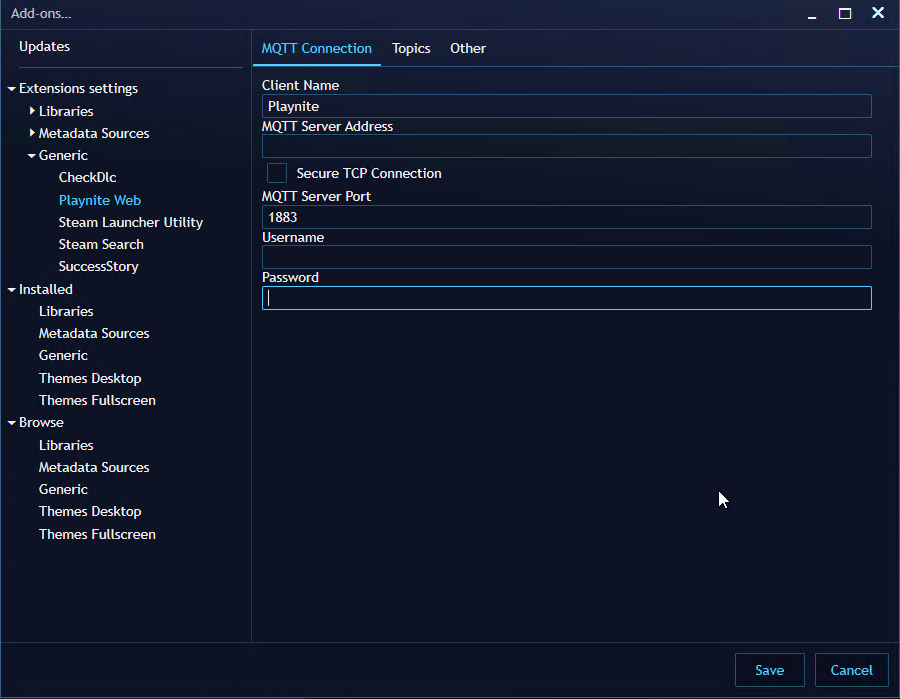
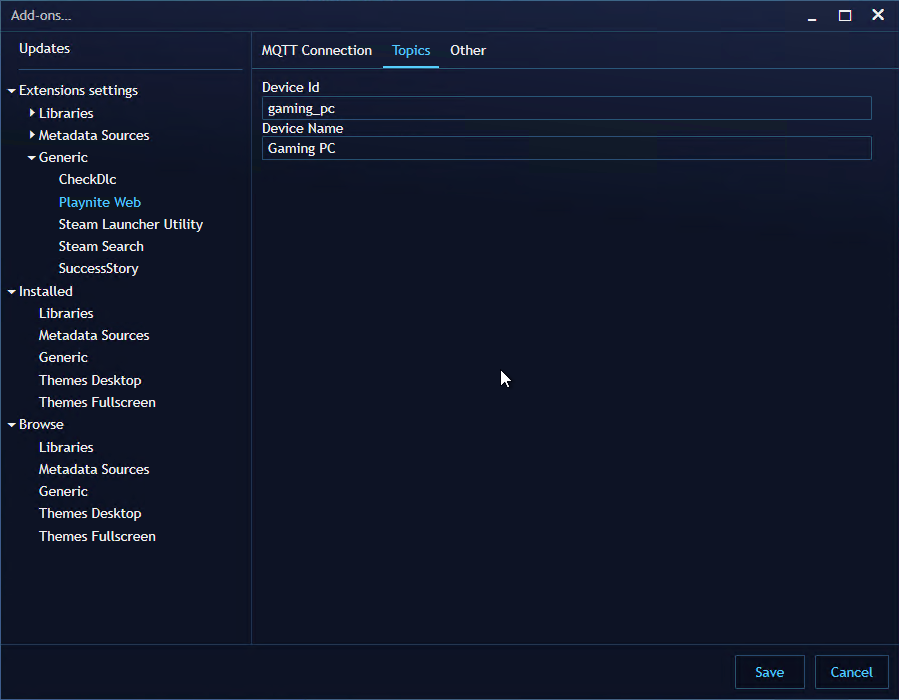

# Playnite-Web

Share, remote control, and automate your game library online with self-hosted Playnite-Web.

Playnite-web offers:

- a beautiful web UI for your Playnite library to share with friends
- remote control of staring and stopping games with home automation; locked behind a username/password login screen
- a graph API to help you build other unique experiences

## Table of Contents

- [Playnite-Web](#playnite-web)
  - [Table of Contents](#table-of-contents)
  - [Getting Started](#getting-started)
    - [Deployment](#deployment)
      - [MQTT Broker](#mqtt-broker)
      - [Database](#database)
      - [Playnite-Web Plugin](#playnite-web-plugin)
      - [playnite-web-app](#playnite-web-app)
        - [Environment Variables](#environment-variables)
    - [Post Deployment Steps](#post-deployment-steps)
  - [Contributing](#contributing)

## Getting Started

Playnite-Web consists the following:

> All components are required.

| Component           | Deployment Mechanism              | Purpose                                                                                                        |
| :------------------ | :-------------------------------- | :------------------------------------------------------------------------------------------------------------- |
| (game) database     | Docker image / bring your own     | Mongo DB database that stores game data in `games` database.                                                   |
| MQTT broker         | Docker image / bring your own     | Provides a communication mechanism between Playnite and Playnite-Web.                                          |
| Playnite-Web Plugin | Extension installed into Playnite | The plugin sends and receives messages via MQTT when data in Playnite is changed.                              |
| Playnite-Web App    | Docker image                      | Syncs Playnite games to game database, web UI, and GraphQL API that may be used to power your own experiences. |

### Deployment

#### MQTT Broker

Recommended to use docker image [`eclipse-mosquitto`](https://hub.docker.com/_/eclipse-mosquitto/). Things to note when deploying:

- IP/hostname used to access the broker
- Port
- Username (only if configured to disable anonymous access)
- Password (only if configured to disable anonymous access)

#### Database

Recommended to use docker image [`mongo:focal`](https://hub.docker.com/_/mongo/). Things to note when deploying:

- Use/mount a persistent volume. See mongodb image documentation for more details.
- IP/hostname used to access the database
- Port
- Username (only if configured to disable anonymous access)
- Password (only if configured to disable anonymous access)

#### Playnite-Web Plugin

1. Download (latest) version [release](https://github.com/andrew-codes/playnite-web/releases) of Playnite extension (release asset named "PlayniteWeb\*ec3439e3-51ee-43cb-9a8a-5d82cf45edac\*.pext").
1. Open Playnite and drag downloaded file into the Playnite. It should prompt to install the plugin.
1. 

Open the plugin's settings and enter the MQTT connection information to your MQTT broker.

      > 
   

1. 

Open the plugin's settings and enter the a device ID and device name under Topics.

   > 
   

#### playnite-web-app

Use the docker [packaged image](https://github.com/andrew-codes/playnite-web/pkgs/container/playnite-web-app) from the repo. Ensure you are using the same release version as the Plugin (above). Example image: `ghcr.io/andrew-codes/playnite-web-app:1.0.0`

##### Environment Variables

| Environment Variable | Value                                            | Required? | Notes                                                             |
| :------------------- | :----------------------------------------------- | :-------- | :---------------------------------------------------------------- |
| PORT                 | Defaults to 3000                                 | Required  | Port in which web application is accessible.                      |
| HOST                 | Defaults to `localhost`                          |           | The domain name or IP address of the server running Playnite-Web. |
| ADDITIONAL_ORIGINS   | Additional origins allowed to request graph API. |           | Multiple values may be provided via a comma-delimited string.     |
| DB_HOST              | IP address/hostname of Mongo DB database         | Required  |                                                                   |
| DB_PORT              | Port of Mongo DB database                        |           | Default for MongoDB image is 27017                                |
| DB_USERNAME          | Username to access database                      |           | Only required if disabled anonymous access                        |
| DB_PASSWORD          | Password to access database                      |           | Only required if disabled anonymous access                        |
| DB_URL               | MongoDB connection URL                           |           | Alternative to individual DB connection options                   |
| DEBUG                | `"playnite-web/*"`                               |           | For troubleshooting; send logs to STDIO                           |
| USERNAME             |                                                  |           | Username used to login                                            |
| PASSWORD             |                                                  |           | Password value used to login                                      |
| SECRET               |                                                  |           | Secret used to protect credentials                                |
| MQTT_HOST            | IP address/hostname of MQTT broker.              | Required  |                                                                   |
| MQTT_PORT            | Port of MQTT broker                              |           | Default for MQTT image is 1883                                    |
| MQTT_USERNAME        | Username to access MQTT broker                   |           | Only required if disabled anonymous access                        |
| MQTT_PASSWORD        | Password to access MQTT broker                   |           | Only required if disabled anonymous access                        |

### Post Deployment Steps

1. Open Playnite and select and "Sync Library" from Playnite Web's menu setting. This is only required once.
   > 
1. Navigate to the web app; `http://$PLAYNITE_WEB_APP_IP:$PORT`

## Contributing

1. Read through our [contributing guidelines](docs/CONTRIBUTING.md).
2. Next, read and set up your [development environment](docs/contributing/development-environment.md).
3. Additionally, refer to the [design docs](docs/design).
