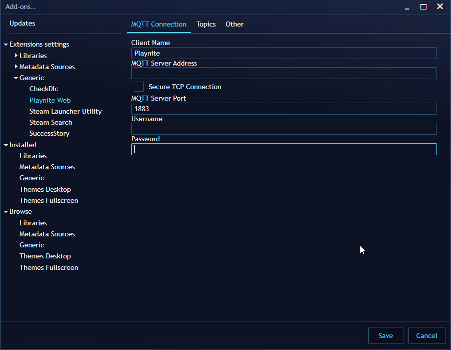
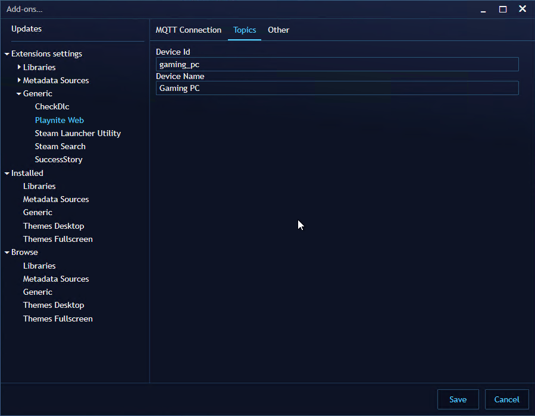
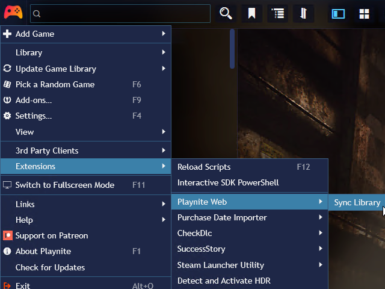

# Playnite-Web

Share your game library online with self-hosted Playnite-Web.

## Getting Started

Playnite-Web consists of several components packaged as Docker images that work together.

> All components are required.

| Component           | Deployment Mechanism              | Purpose                                                                                                   |
| :------------------ | :-------------------------------- | :-------------------------------------------------------------------------------------------------------- |
| MQTT broker         | Docker image / bring your own     | Provides a communication mechanism between Playnite and Playnite-Web.                                     |
| Playnite-Web Plugin | Extension installed into Playnite | The plugin sends and receives messages via MQTT when data in Playnite is changed.                         |
| game-db-updater     | Docker image                      | Receives MQTT messages from plugin and updates game data in database.                                     |
| database            | Docker image / bring your own     | Mongo DB database that stores game data in `games` database.                                              |
| Playnite-Web App    | Docker image                      | Web application and UI to browse and view game library. Can be exposed to Internet to share with friends. |

### Deployment

#### MQTT Broker

Recommended to use docker image [`eclipse-mosquitto`](https://hub.docker.com/_/eclipse-mosquitto/). Things to note when deploying:

- IP/hostname used to access the broker
- Port
- Username (only if configured to disable anonymous access)
- Password (only if configured to disable anonymous access)

#### Database

Recommended to use docker image [`mongo:focal`](https://hub.docker.com/_/mongo/). Things to note when deploying:

- Use/mount a persistent volume. See mongodb image documentation for more details.
- IP/hostname used to access the database
- Port
- Username (only if configured to disable anonymous access)
- Password (only if configured to disable anonymous access)

#### Playnite-Web Plugin

1. Download (latest) version [release](https://github.com/andrew-codes/playnite-web/releases) of Playnite extension (release asset named "PlayniteWeb_ec3439e3-51ee-43cb-9a8a-5d82cf45edac_0_1.pext").
1. Open Playnite and drag downloaded file into the Playnite. It should prompt to install the plugin.
1. Open the plugin's settings and enter the MQTT connection information to your MQTT broker.
   > 
1. Open the plugin's settings and enter the a device ID and device name under Topics.
   > 

#### game-db-updater

Use the docker [packaged image](https://github.com/andrew-codes/playnite-web/pkgs/container/playnite-web-game-db-updater) from the repo. Ensure you are using the same release version as the Plugin (above). Example image: `ghcr.io/andrew-codes/playnite-web-game-db-updater:1.0.0`

##### Environment Variables

| Environment Variable | Value                                    | Notes                                                |
| :------------------- | :--------------------------------------- | :--------------------------------------------------- |
| MQTT_HOST            | IP address/hostname of MQTT broker.      |                                                      |
| MQTT_PORT            | Port of MQTT broker                      | Default for MQTT image is 1883                       |
| MQTT_USERNAME        | Username to access MQTT broker           | Optional, only required if disabled anonymous access |
| MQTT_PASSWORD        | Password to access MQTT broker           | Optional, only required if disabled anonymous access |
| DB_HOST              | IP address/hostname of Mongo DB database |                                                      |
| DB_PORT              | Port of Mongo DB database                | Default for MongoDB image is 27017                   |
| DB_USERNAME          | Username to access database              | Optional, only required if disabled anonymous access |
| DB_PASSWORD          | Password to access database              | Optional, only required if disabled anonymous access |
| DEBUG                | `"game-db-updater/*"`                    | Optional, for troubleshooting; send logs to STDIO    |

#### playnite-web-app

Use the docker [packaged image](https://github.com/andrew-codes/playnite-web/pkgs/container/playnite-web-app) from the repo. Ensure you are using the same release version as the Plugin (above). Example image: `ghcr.io/andrew-codes/playnite-web-app:1.0.0`

##### Environment Variables

| Environment Variable | Value                                    | Notes                                                |
| :------------------- | :--------------------------------------- | :--------------------------------------------------- |
| PORT                 | Defaults to 3000                         | Port in which web application is accessible.         |
| DB_HOST              | IP address/hostname of Mongo DB database |                                                      |
| DB_PORT              | Port of Mongo DB database                | Default for MongoDB image is 27017                   |
| DB_USERNAME          | Username to access database              | Optional, only required if disabled anonymous access |
| DB_PASSWORD          | Password to access database              | Optional, only required if disabled anonymous access |
| DEBUG                | `"playnite-web/*"`                       | Optional, for troubleshooting; send logs to STDIO    |
| USERNAME             |                                          | Username used to login                               |
| PASSWORD             |                                          | Password value used to login                         |
| SECRET               |                                          | Secret used to protect credentials                   |
| MQTT_HOST            | IP address/hostname of MQTT broker.      |                                                      |
| MQTT_PORT            | Port of MQTT broker                      | Default for MQTT image is 1883                       |
| MQTT_USERNAME        | Username to access MQTT broker           | Optional, only required if disabled anonymous access |
| MQTT_PASSWORD        | Password to access MQTT broker           | Optional, only required if disabled anonymous access |

### Post Deployment Steps

1. Open Playnite and select and "Sync Library" from Playnite Web's menu setting. This is only required once.
   > 
1. Navigate to the web app; `http://$PLAYNITE_WEB_APP_IP:$PORT`
