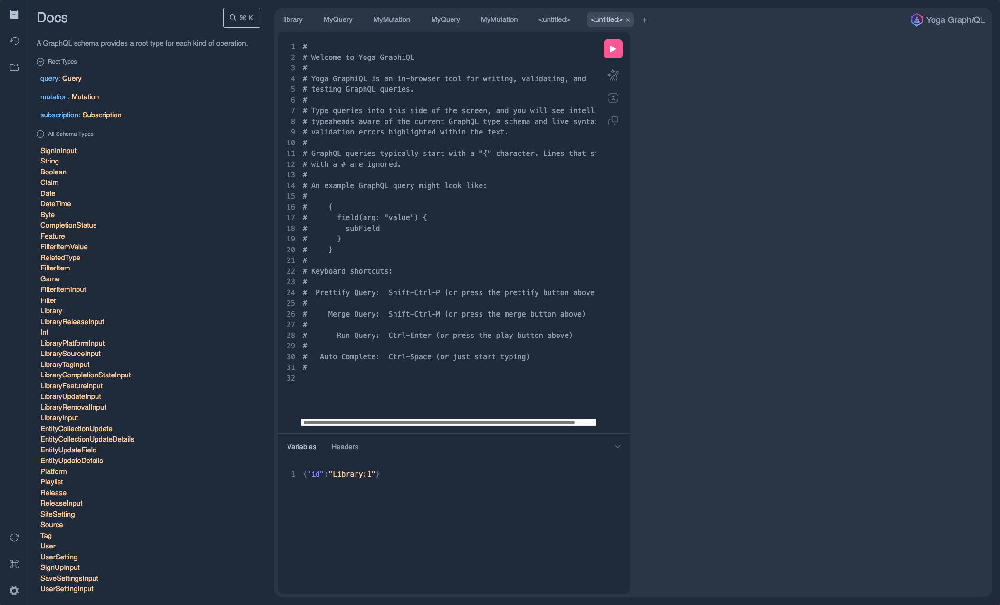

# Playnite Web Data Model

## Differences from Playnite

### Playnite.Game vs Game vs Release

All game items in Playnite are considered `Playnite.Game` entities. However, people tend to consider a group of `Playnite.Game`s as a game, where the game is released on one or more platforms. As an example, `Silent Evil 9` is a game that was released on multiple platforms; PlayStation, Steam, Epic, and Xbox. Modeling this in Playnite, there are 4 unique games (`Playnite.Game`). In Playnite Web, this is a single `Game` that has 4 releases `Release`. Each release is on a Platform (`Platform`) of PlayStation, PC, and Xbox. The platform is computed from the associated `Source` and its associated `Platform`. In this example, both Steam and Epic sources are associated with the PC platform. The source to platform associations are configured in the settings of the Playnite Web extension for Playnite.

`Game` is a concept that is not present in Playnite at all, but is present in Playnite Web. `Game`s are computed by grouping `Playnite.Game`s by their name. Note that a game may be released on platforms on different dates; sometimes years apart. Consider exclusives that eventually come to other platforms. For this reason, we cannot group `Playnite.Game`s by name and release date to determine what `Game` a `Release` belongs.

## GraphQL API

The graph API and its definition can be viewed by navigating to a running instance of Playnite Web. Navigate to the home page of Playnite web and add `/api` to the URL path. You will see the Graph explorer (shown below). Note you can browse entity, query, and mutation definitions as well as executing queries against the API. This can aid in consuming the graph API for other purposes.

